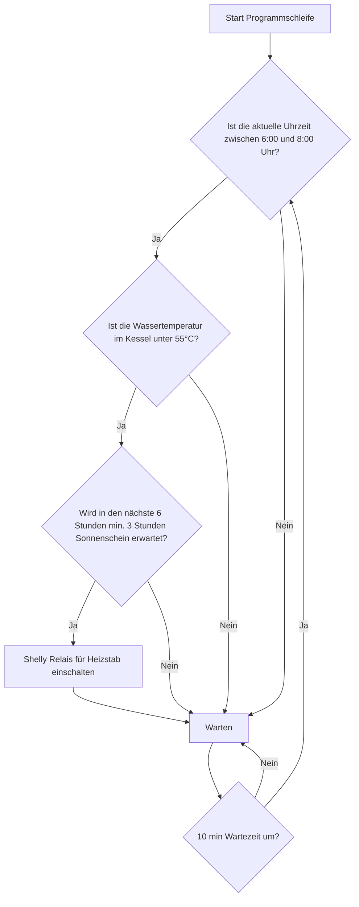

# Shelly Weather Forecast
Abhängig von der Uhrzeit, der aktuellen Kesselthemperatur und der Wettervorhersage soll ein Tauschsieder eingeschaltet werden. 

## Hardware
- Shelly Plus 2PM
- Shelly Plus Add-On für Themperatursensoren
- Heizstab mit 4 Stufen (1,5 kW)
- Röhren-Kollektor

## Grober Prozessablauf

## Offene Fragen
- Schaltet Tauchsieder automatisch ab bei gewünschter Temperatur?

## Hilfreiche Links
-  [Smart-heating-management-with-Shelly](https://github.com/LeivoSepp/Smart-heating-management-with-Shelly)
-  [PV Forecast ](https://toolkit.solcast.com.au/)
