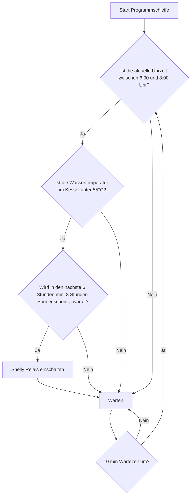

# Shelly Weather Forecast
Abhängig von der Uhrzeit, der aktuellen Kesselthemperatur und der Wettervorhersage soll ein Tauschsieder eingeschaltet werden. 

## Hardware
- Shelly Plus 2PM
- Shelly Plus Add-On für Themperatursensoren

## Grober Prozessablauf

## Fragen
- Tauchsieder schaltet automatisch ab?
